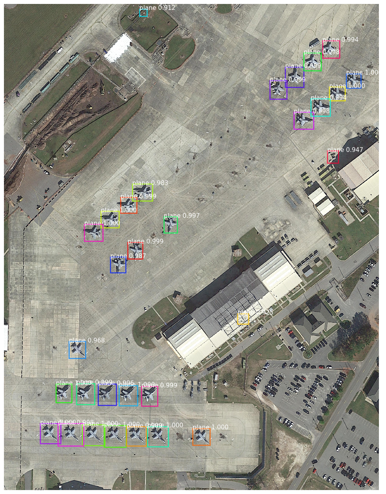
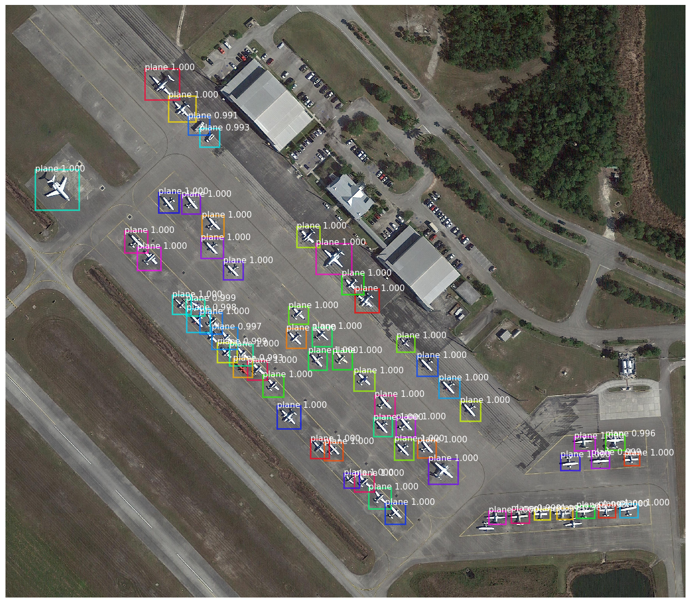
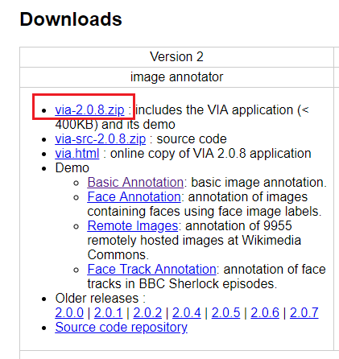

# Object Detection in Aerial Images

* 작성자: 건국대학교 신기술융합학과 석사과정 김혜진
* 작성일자: 2019-08-30
* 개요: Mask R-CNN을 이용한 항공사진에서 객체 탐지 실험
* 키워드: object detection, mask r-cnn, keras, DOTA dataset, aerial imagery

* 수정자: 건국대학교 지형영상처리 연구실 원태연
* 작성일자: 2020-04-07
* 개요: Mask R-CNN을 이용한 항공사진에서 객체 탐지 실험 - 쉽게 학습을 가능하게.

## Results






## 0. Note

* 실험 순서

  * 소스코드 다운로드
  * 실험 환경 구성
  * 데이터 셋 준비 
  * 학습
  * 예측


## 1. Source Download

- source: https://github.com/merrybingo/object_detection.git
  - original source: <https://github.com/matterport/Mask_RCNN>  [MIT License]
  - 원본 소스를 실험에 맞게 코드를 수정하여 사용함

```bash
git clone https://github.com/merrybingo/object_detection.git
```


## 2. Environment

- Windows 10
- Anaconda 3
- Python 3.7

```bash
conda create -n detection python=3.7
conda activate detection
```


### Dependencies

for cpu
- tensorflow 1.15.2
- keras 2.2.5
- scikit-image
- matplotlib
- IPython[all]
- imageio

for gpu
- tensorflow-gpu 1.15.0 (anaconda3)
- keras-gpu 2.2.4 (anaconda3)
- scikit-image
- matplotlib
- IPython[all]
- imageio

### Installation

```bash
pip install -r requirements.txt
```


### Download weights

- coco dataset 미리 학습된 모델을 object_detection 폴더에 넣어 놓아야 함

  - Download pre-trained COCO weights (mask_rcnn_coco.h5) from the [releases page](https://github.com/matterport/Mask_RCNN/releases). Mask R-CNN 1.0 release, Asserts의 mask_rcnn_coco.h5 파일입니다.

  

##  3. Dataset

* 데이터 셋 구조

```bash
dataset
├── train 
│   └── *.png
│   └── ...
│   └── via_region_data.json
├── val 
│   └── *.png
│   └── ...
│   └── via_region_data.json
├── test 
│   └── *.png
│   └── ...
│   └── via_region_data.json
```

`* via_region_data은 영역 라벨링 파일임. via툴을 사용하여 라벨링 결과를 export할 경우 via_export_json.json으로 저장되므로 파일명을 via_region_data로 바꿔야함 `


* 데이터 셋 만드는 방법

  * train, validation, test 이미지 준비

    * train & validation : test는 8:2의 비율이 좋음
    * train : validation는 8:2의 비율이 좋음
    * 50장을 기준으로 train : validation : test = 32장 : 8장: 10장으로 함
    
  * 라벨링 툴
    
    * VIA tool: <http://www.robots.ox.ac.uk/~vgg/software/via/>
    
    
    
    * via-2.0.8.zip 다운로드 및 압축 풀기 >  via.html 실행
    
    * Add Files 버튼 클릭 > 이미지 추가 
    
    * **Rectangle** shape 클릭 > 정답 영역 그리기
    
      * Polygon shape으로 그려도 됨 (결과가 더 정확함)
      * Rectangle과 Polygon을 섞어서 사용하지 말 것
    * Annotation 탭 > Export Annotations (as json) 클릭 및 저장
    
      * train 폴더와 val 폴더 그리고 test 폴더에 각각 via_region_data.json로 저장하면 됨


## 4. Usage

### training

* epochs = 30
* steps_per_epoch = 100
* 31시간 소요됨 (windows10 /  core i7-7700 / RAM 16GB / GPU 안씀)

```bash
cd object_detection/code
python train.py train --dataset=/path/to/dataset --weights=coco

# ex) python train.py train --dataset=../dataset/ --weights=coco
```

* 학습이 완료되면 학습시간과 "finish"를 프린트하고 종료됨
* 학습이 완료되면 logs 폴더 밑으로 object학습시작시간 / mask_rcnn_object_0030.h5 가 생성됨 


### prediction

```bash
cd object_detection/code
python predict.py --dataset=/path/to/dataset --weights=logs/object_time/weights.h5

# ex) python predict.py --dataset=../dataset/ --weights=logs/object20190830T1539/mask_rcnn_object_0030.h5
```

* 예측이 완료되면 dataset/test/ 폴더 밑으로 이미지_detect.png 이미지들이 생성됨


### evaluation

* 성능평가, mAP (Mean Average Precision) 계산

```bash
cd object_detection/code
python evaluate.py --dataset=/path/to/dataset --weights=logs/object_time/weights.h5

# ex) python evaluate.py --dataset=../dataset/ --weights=logs/object20190830T1539/mask_rcnn_object_0030.h5
```

* 평가가 완료되면 mAP % 수치가 프린트 됨
